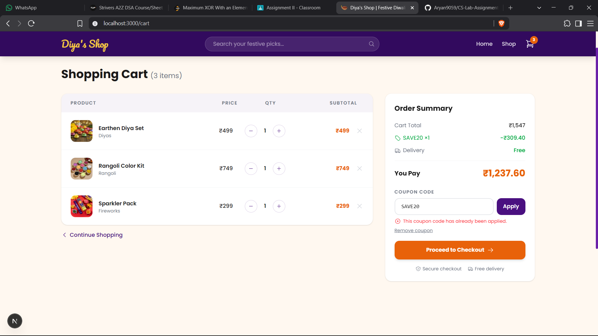

# Diya's Shop: Business Logic Flaw Demo

**Diya's Shop** is a deliberately vulnerable Diwali e-commerce web application built to demonstrate a **Business Logic Flaw** in coupon/discount handling. It was created as part of a Cyber Security lab assignment.

---

## Table of Contents

- [What is a Business Logic Flaw?](#what-is-a-business-logic-flaw)
- [Tech Stack](#tech-stack)
- [Project Structure](#project-structure)
- [Getting Started](#getting-started)
- [The Vulnerability: Unlimited Coupon Stacking](#the-vulnerability-unlimited-coupon-stacking)
  - [How it Works Normally](#how-it-works-normally)
  - [The Flaw in the Code](#the-flaw-in-the-code)
  - [Exploiting the Flaw](#exploiting-the-flaw)
  - [The Fix](#the-fix)
- [Video Demonstration](#video-demonstration)

---

## What is a Business Logic Flaw?

A Business Logic Flaw is not a typical coding mistake (like a buffer overflow or SQL injection) but rather a **faulty assumption about how a legitimate process should behave**. It happens when developers fail to anticipate unusual but technically valid inputs that subvert the intended business logic of the application.

In this project, the developer assumed a user would only apply a coupon code once. Nothing is hacked or bypassed — the server does exactly what it was told. The flaw lies entirely in what the developer *forgot* to check.

---

## Tech Stack

| Layer | Technology |
|---|---|
| Framework | [Next.js 16](https://nextjs.org/) (App Router) |
| Language | TypeScript 5 |
| Styling | Tailwind CSS v4 |
| Icons | Heroicons v2 |
| State Management | React Context API + `useReducer` |
| Persistence | `localStorage` (client-side) |
| API | Next.js Route Handlers (serverless) |
| Fonts | Google Fonts — Poppins & Pacifico |

---

## Project Structure

```
app/
├── page.tsx                  # Home / landing page
├── layout.tsx                # Root layout with CartProvider, Navbar, Footer
├── globals.css               # Global styles
├── products/
│   ├── page.tsx              # Product listing page
│   └── [id]/page.tsx         # Individual product detail page
├── cart/
│   └── page.tsx              # Cart page — contains the vulnerable coupon logic
└── api/
    └── coupon/
        └── route.ts          # Vulnerable API endpoint (POST /api/coupon)

lib/
├── data.ts                   # Product data & types (8 Diwali products)
└── store.tsx                 # Cart state: Context, Reducer, CartProvider hook

components/
├── Navbar.tsx                # Navigation bar with live cart count badge
├── Footer.tsx                # Site footer
├── ProductCard.tsx           # Reusable product card component
├── ProductImage.tsx          # Image wrapper with fallback
└── CategoryIcon.tsx          # Category icon mapper
```

---

## Getting Started

```bash
# Install dependencies
npm install

# Run the development server
npm run dev
```

Open [http://localhost:3000](http://localhost:3000) to see the app.

---

## The Vulnerability: Unlimited Coupon Stacking

### How it Works Normally

1. User browses the shop and adds Diwali products to their cart.
2. On the cart page, the user enters the coupon code **`SAVE20`**.
3. The frontend calls `POST /api/coupon` with the code and the current cart total.
4. The API validates the code and returns a new total with **20% off**.
5. The cart is updated to show the discounted price.



---

### The Flaw in the Code

The vulnerability exists across **two files** working together:

#### 1. `app/api/coupon/route.ts` — The Stateless API

```typescript
export async function POST(request: Request) {
  const { code, currentTotal } = await request.json();

  if (code === "SAVE20") {
    const newTotal = parseFloat((currentTotal * 0.8).toFixed(2));
    return Response.json({ valid: true, discountPercent: 20, newTotal });
  }
  // ...
}
```

The server is **completely stateless**:
- No session tracking
- No database record of coupon usage
- Blindly trusts the client-provided `currentTotal`
- Has no concept of "already applied"

It simply applies 20% to whatever total is sent to it, every single time.

#### 2. `app/cart/page.tsx` — The Missing Client-Side Guard

The `handleApplyCoupon` function has the duplicate-check logic **commented out**:

```typescript
// if (couponLog.some((entry) => Object.values(entry).some((value) => value === normalizedCode))) {
//   setCouponError("This coupon code has already been applied.");
//   return;
// }
```

Without this guard, the function proceeds to call the API every time with no restriction.

#### 3. `lib/store.tsx` — The Reducer Accepts Every Call

The `APPLY_DISCOUNT` action in the cart reducer blindly appends every application to the `couponLog` with no validation:

```typescript
case "APPLY_DISCOUNT": {
  // VULNERABILITY: No check on how many times the coupon has been used.
  const before = state.discountedTotal ?? computeOriginal(state.items);
  const after = action.newTotal;
  // ...
  return { ...state, discountedTotal: after, couponLog: [...state.couponLog, entry] };
}
```

---

### Exploiting the Flaw

Because each API call takes the *already-discounted* total as the new `currentTotal`, the discount **compounds exponentially** with every application:

| Application | Total (₹) | Discount (₹) |
|---|---|---|
| Original | 5,000.00 | — |
| Apply #1 | 4,000.00 | −1,000.00 |
| Apply #2 | 3,200.00 | −800.00 |
| Apply #3 | 2,560.00 | −640.00 |
| Apply #4 | 2,048.00 | −512.00 |
| Apply #5 | 1,638.40 | −409.60 |
| ... | → ₹0 | Free! |

The attacker simply types `SAVE20` and clicks **Apply** repeatedly until the total approaches zero — no hacking tools, no special knowledge, just a browser.


---

### The Fix

The fix must be applied on both the **client** and **server** side:

#### Client-Side Fix (`app/cart/page.tsx`)

Uncomment the duplicate-coupon guard before the API call:

```typescript
if (couponLog.some((entry) => Object.values(entry).some((value) => value === normalizedCode))) {
  setCouponError("This coupon code has already been applied.");
  return;
}
```

This checks the `couponLog` (the history of applied coupons in the current session) and blocks re-application of the same code.

> [!WARNING]
> Client-side validation alone is **not sufficient** — it can be bypassed by calling the API directly (e.g., with `curl` or Postman). A proper fix must also be enforced on the server.

#### Server-Side Fix (`app/api/coupon/route.ts`)

The server must be made **stateful** — it should track coupon usage per session or per user account in a database, and reject requests where the coupon has already been used:

```typescript
// Pseudo-code for a proper server-side fix:
const usageCount = await db.getCouponUsage(sessionId, code);
if (usageCount >= 1) {
  return Response.json({ valid: false, message: "Coupon already used." }, { status: 400 });
}
await db.recordCouponUsage(sessionId, code);
// ...apply discount
```

---

## Video Demonstration

A full screen-capture video with voiceover narration covering:
1. Normal app walkthrough & code overview
2. Live attack demonstration (coupon stacking)
3. Technical explanation of the flaw and the fix

 <br>
Link to video: https://drive.google.com/file/d/1G67HPX2iBjpXuTNgmQ2MBYIE5ZkfOaCT/view?usp=sharing
